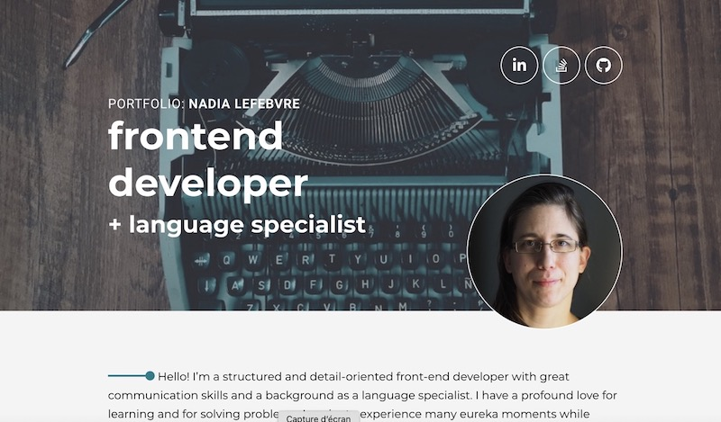

# Project Portfolio v1

Weekly project for Technigo's bootcamp, week 8: build a portfolio (March 2022)

## Tech stack

- HTML
- CSS
- Figma

## The problem

For this project, I had to create a responsive webpage based on a design in Figma for our portfolio, with focus on accessibility.

No JavaScript in this project, only HTML and CSS. I used validating tools to assess web accessibility of my webpage, such as color contrast, use of alt text and aria labels, semantic HTML, etc. I used meta tags for social media sharing. I followed the design very closely and am very happy with my process and the result. I used my own domain to deploy my project.

## View it live

Project deployed here: [Nadia Lefebvre | Portfolio](https://nadialefebvre.netlify.app/)

**This version haven't been updated since final project for Technigo's bootcamp (June 2022), please check my repo for version 2 here: [Portfolio v2](https://github.com/nadialefebvre/project-portfolio-v2), which is made with React and TypeScript, among others.

  

